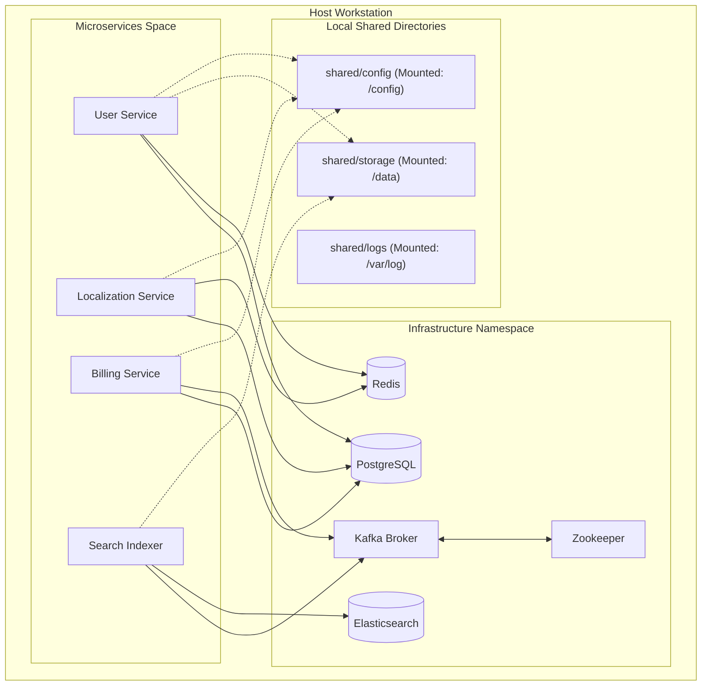

# Platform Architecture Overview

This document describes the architectural layout of the shared development infrastructure stack for the DIGIT platform, detailing how microservices communicate and access shared persistence channels.

## Platform Boundaries

## Shared Services Directory Mapping

All services are built to communicate purely via container-to-container channels utilizing container names as host identifiers:

*   **Database Host**: `postgres` (Port `5432`)
*   **Cache Store**: `redis` (Port `6379`)
*   **Event Broker**: `kafka` (Port `29092` internal, `9092` external host)
*   **Indexing Engine**: `elasticsearch` (Port `9200`)

By mapping local directories:
- `./shared/storage` to `/data` in container runtimes.
- `./shared/config` to `/config` in container runtimes.

We eliminate absolute dependencies on any specific developer's local filesystem paths, allowing instant deployment portability between Linux, macOS, and Windows workstation platforms.
