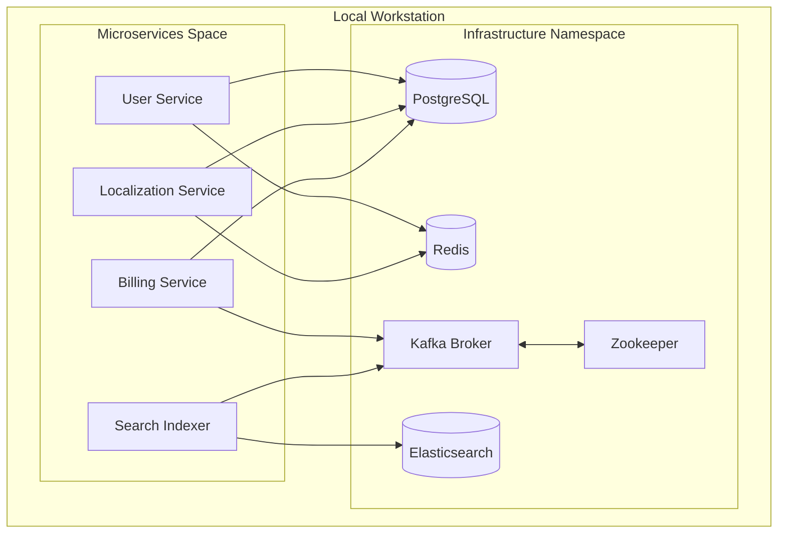

# Architecture Overview

This document describes the architectural layout of the shared development infrastructure stack for the DIGIT platform.

## High-Level Topology

## Service Components

### 1. Relational Persistence Layer (PostgreSQL)
PostgreSQL handles persistent structured relational storage. In a typical DIGIT installation, multiple microservices utilize separate databases to maintain microservice boundaries. 
- **Dynamic Database Bootstrapping**: The initialization sequence loads a dynamic bootstrapper script (`postgres/init/01-init-databases.sh`) to automatically spin up discrete database schemas dynamically defined in the environment.

### 2. Message Bus & Event Streaming Layer (Kafka & Zookeeper)
Kafka is the primary backbone for asynchronous event communication (e.g. notifications, indexing triggers, transactional audit trails).
- **Zookeeper**: Manages Kafka cluster state, topic configurations, and broker election.
- **Dynamic Provisioning**: Broker configuration includes `auto.create.topics.enable=true` to simplify developer setups. A convenience topic creation helper `kafka/scripts/create-topics.sh` pre-configures standard topics.

### 3. Caching & Fast Read-Write Store (Redis)
Redis serves as the caching layer for user session management, access tokens, and localized dictionary items to reduce the load on PostgreSQL.
- **Memory Safety**: Local configurations limit memory consumption (256MB) to ensure system stability when running several microservices.

### 4. Search & Indexing Engine (Elasticsearch)
Elasticsearch stores documents for quick semantic and structural searching across multiple modules.
- **Development Mode**: Set to `discovery.type=single-node` to avoid cluster discovery overhead on local workstations.
